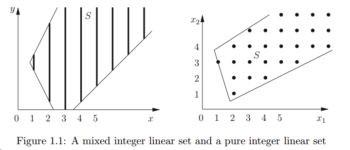
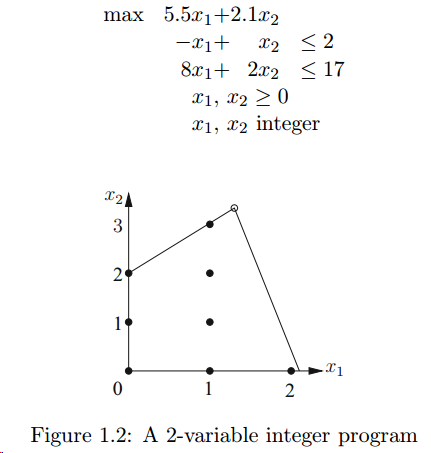
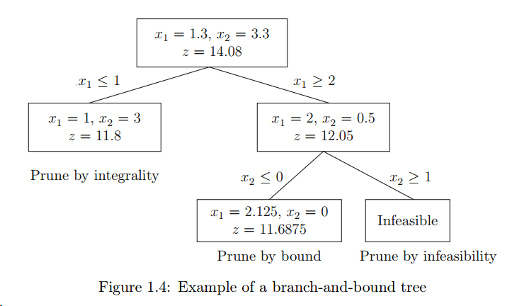
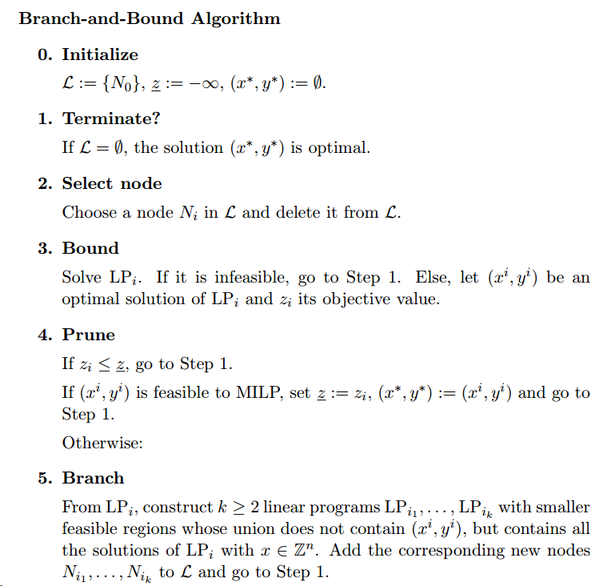
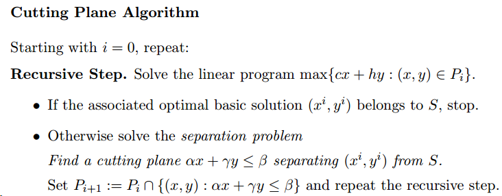
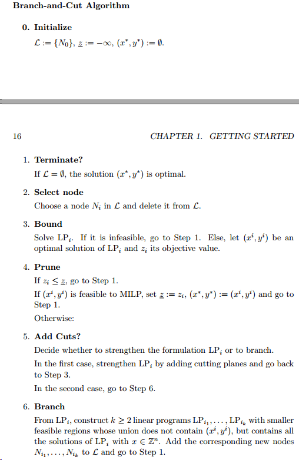
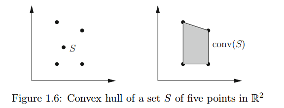

# *Integer Progamming* Reading Note 1 —— Getting Started

## Integer Programming

整数规划的general form
$$
\begin{aligned}
\max & &cx\\
\text{subject to}&&Ax\leq b\\
&& x>0& &\text{integral}
\end{aligned}
$$

混合整数规划的general form
$$
\begin{aligned}
\max & &cx+hy\\
\text{subject to} && Ax+Gy\leq b\\
&& x\geq 0 && \text{integral}\\
&& y\geq 0 \\
\end{aligned}
$$

举个简单的例子，两个变量的整数规划

按照线性规划来解很容易，最优解为$x_1=1.3,x_2=3.3$，最大值为$14.08$，但题中的两个变量都要求为是整数，所以我们的最优解为$x_1=1,x_2=3$，最大值为$11.8$。如果变量个数少，则我们可以通过枚举法等手段来解，但是随着变量数量的增加，我们可行解的数量呈指数增长，所以我们必须要设计别的算法来解决整数规划问题。

## Methods for Solving Integer Programs

解决整数规划主要有两种办法：
- branch and bound 分支定界
- cutting plane 割平面

以下用$x^*,y^*,z^*$表示最优解，用$x^0,y^0,z^0$表示一组可行解。

### The Branch-and-Bound Method

B&B主要的想法是通过上下界来逐步缩小可行域范围，如将变量$x_j$分成两部分，

$$
S_1=S \cap \{(x,y): x_j \leq \lfloor f \rfloor\},S_2=S \cap \{(x,y): x_j \geq \lceil f \rceil\}
$$

然后分别计算两部分

$$
\text{MILP}_1:\max\{cx+hy:(x,y)\in S_1\},\text{MILP}_2:\max\{cx+hy:(x,y)\in S_2\}
$$

这是我们可以对其约束做线性放松，然后计算每个线性问题的最优值作为整数规划的最优下界，

$$
\text{LP}_1:\max\{cx+hy:(x,y)\in P_1\},\text{LP}_2:\max\{cx+hy:(x,y)\in P_2\}
$$

然后进行判断：
- 如果其中一个线性规划无可行解，则其对应的整数规划无可行解，我们说该问题被pruned by infeasibility
- 令$(x^i,y^i)$为$\text{LP}_i$的最优解
    - 如果$x^i$ 都是整数，则$(x^i,y^i)$为$\text{MILP}_i$的最优解，$z_i$为原问题的下界，此时我们说问题被pruned by integrality
    - 如果$x^i$ 不全是整数且并且$z_i$比原问题的下界小，则这部分可行域上不存在最优解，我们说这个问题被pruned by bound
    - 如果$x^i$ 不全是整数且并且$z_i$比原问题的下界大，则$S_i$肯定包含更优的解，然后对这部分可行域重复该过程

通过不断去划分支来分割可行域，并删除不需要的部分来找到最优的过程，这种方法就被称为branch and bound。

### The Cutting Plane Method

割平面法是用来解决初始解并不在$S$中，核心的想法是找到一个不等式$\alpha x + \gamma y\leq \beta$，满足在$S$中的每个点都有$\alpha x^0 + \gamma y^0 > \beta$。这样不等式的存在保证了$(x^0,y^0)$一定会是一个基础解。

定义
$$
P_1=P_0\cap\{(x,y):\alpha x+ \gamma y\leq\beta\}
$$
则有$S\subseteq P_1\subset P_0$，这样放松的混合整数规划问题会比线性放松约束的整数规划问题要stronger（这个词不好翻译，大家意会）
$$
\max\{cx+hy:(x,y)\in P_1\}
$$
是关于最优解$z^*$的一个足够好的上界。

关于如何cut的方式后面会具体讲到，比较出名的是Gomory fractional cut。

给我感觉，B&B和CP两种方式一个是从可行解出发，将可行解作为原问题的最优解的下界，即所有可能成为最优解，肯定会比这组解大，然后不断去求子问题的上界，如果子问题上界小于这个下界，则最优解必然不在这个子问题的可行域里，如果子问题上界大于这个下界，则继续划分子问题的可行域，总体来说是在可行域中往边界走（因为最优值必然在边界处取得），而CP，更是像一种，知道了非可行最优解的上界，然后不断地切割可行范围，得到可行的最优解，是一种从可行域外往可行域边界上走，不断拉低松弛问题的最优上界，得到原问题的最优解。

**注：写到这里我才发现自己通篇都用的是原问题这种描述，可能会和以后对偶的原问题混淆，所以本篇中的原问题都指的是初始问题！**

### The Branch-and-Cut Method

在B&B的问题中，由于是直接线性放松约束条件，会产生较大的间隔，这样会产生一个很大的树状结构，这时我们就可以用割平面来缩紧上界，这样就有了B&C

## Complexity

- 多项式复杂度
- NP

## Convex Hulls and Perfect Formulations

- 凸包的定义

