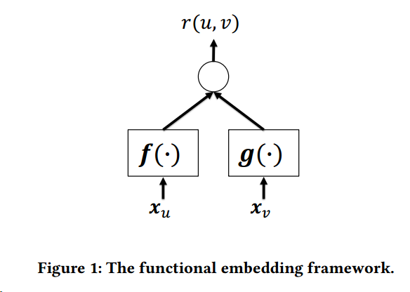
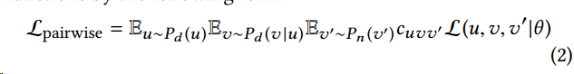
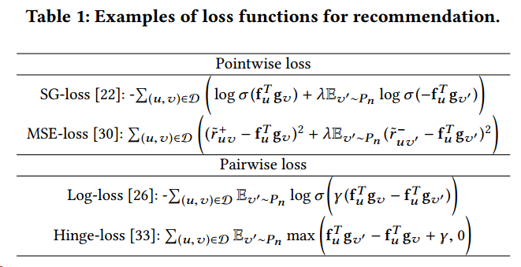
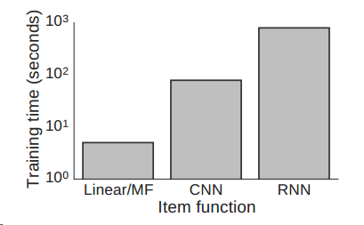
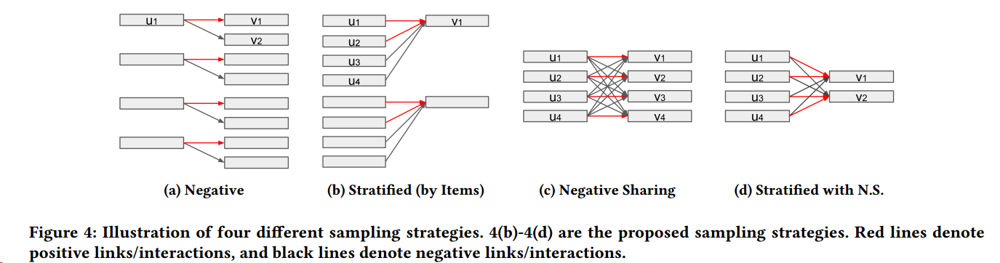

# On Sampling Strategies for Neural Network-based Collaborative Filtering 

这篇文章主要解决了由于对物品和对用户做embedding时时长差距较大情况，而提出多种采样方式，来提高总体的训练速度，文中的review总结的很好。

作者先对已有的embedding做推荐的方式做了一个framework，如上图所示，矩阵分解或者其他embedding都可以认为是one-hot的用户与物品经过functional embedding之后再得到最后的结果。

作者对当前implicit feedback的loss function做了总结，主要为point-wise loss和pair-wise loss：

具体loss各列举了两种

上述公式第一次看可能太乱不想看，仔细瞅瞅总结的很到位。

之后作者说因为引入NN的原因，所以很多情况对于item的特征提取会很费时间

所以在一般随机选取负例样本的时候，会造成物品embedding时间过长，所以提出几种方式来加速

具体实现细节见论文。之后推荐系统上NN的小伙伴可以关注一下这个小技巧。

