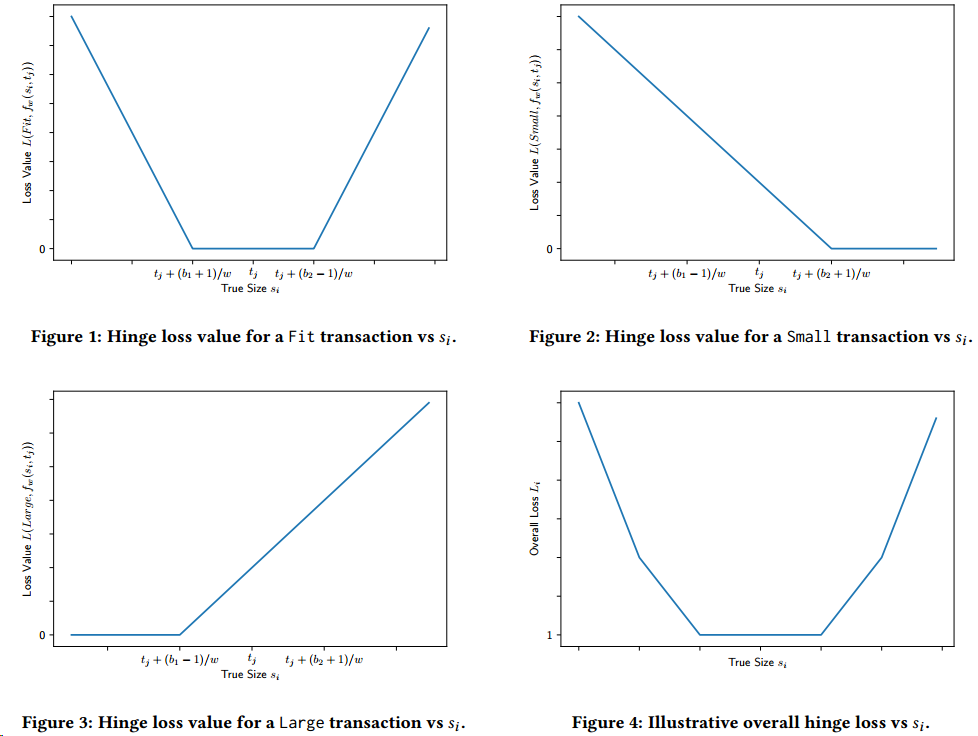
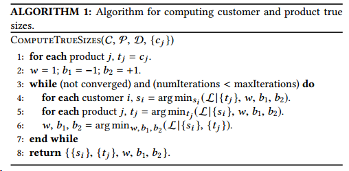
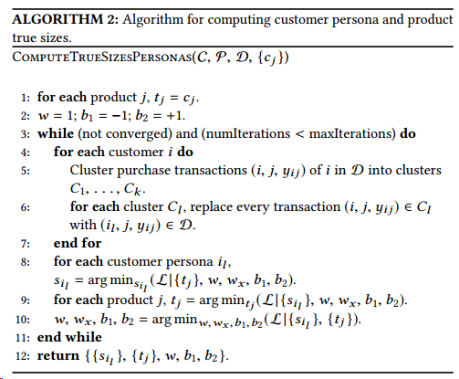

Recommending Product Sizes to Customers

这篇文章主要做的内容是将正确size的商品推荐给客户，很细致的工作，亚马逊的推荐，发表在recsys2017。

定义一个商品为parent product，而这个商品的不同尺寸的SKU称之为其的child prodcut，产品集合$\mathcal{P}$，用户集合$\mathcal{C}$，购买记录集合$\mathcal{D}=(i,j,y_{ij})$表示用户$i$购买$j$产品然后退换商品型号为$y_{ij}$。思路也很简单，如果一个用户购买的商品size合适，则退换记录则为$(i,j,\text{Fit})$，这个时候商品的真实大小$t_j$和用户的真实大小$s_i$则会非常接近，同理对于较大和较小的商品，商品真实大小和用户的真是尺寸则会相差较大，我们的目标就是去优化这样一个差值，让其最小定义一个线性函数
$$
f_w(s_i,t_j)=w\dot (s_i-t_j)
$$
表明商品符合程度，定义损失函数
$$
L(y_{ij},f_w(s_i,t_j))
$$
同时，如果需要将输出变成$\{-1,+1\}$则定义
$$
L(y_{ij},f_w(s_i,t_j))=\begin{cases}
L^{\text{bin}}(+1,f_w(s_i,t_j)-b_2)& \text{if }y_{ij}=\text{Small}\\
L^{\text{bin}}(-1,f_w(s_i,t_j)-b_2)+L^{\text{bin}}(+1,f_w(s_i,t_j)-b_1)& \text{if }y_{ij}=\text{Fit}\\
L^{\text{bin}}(-1,f_w(s_i,t_j)-b_1)& \text{if }y_{ij}=\text{Large}
\end{cases}
$$
其中$b_1$和$b_2$是阈值参数且$b_2>b_1$，将得分函数分成三部分，如果比$b_2$大则属于Small，小于$b_1$则属于Large，处于其中则表示合适。如果一次购买的商品笑了，我们希望$f_w(s_i,t_j)$比$b_2$大，所以我们给$f_w(s_i,t_j)-b_2$的标签为$+1$，反之同理。
由于这个损失函数必然不连续，不可微，所以对于后面的模型是难以优化的，所以我们考虑一些替代损失函数，可以选择Hinge Loss
$$
L(y_{ij},f_w(s_i,t_j))=\begin{cases}
\max(0,1-f_w(s_i,t_j)+b_2)& \text{if }y_{ij}=\text{Small}\\
(\max(0,1+f_w(s_i,t_j)-b_2)+\max(0,1-f_w(s_i,t_j)+b_1))& \text{if }y_{ij}=\text{Fit}\\
\max(0,1+f_w(s_i,t_j)-b_1)& \text{if }y_{ij}=\text{Large}
\end{cases}
$$
或者Logistic Loss
$$
L(y_{ij},f_w(s_i,t_j))=\begin{cases}
\log(\frac{1}{1+e^{-f_w(s_i,t_j)+b_2}})& \text{if }y_{ij}=\text{Small}\\
(\log(\frac{1}{1+e^{f_w(s_i,t_j)-b_2}})+\log(\frac{1}{1+e^{-f_w(s_i,t_j)+b_1}}))& \text{if }y_{ij}=\text{Fit}\\
\log(\frac{1}{1+e^{f_w(s_i,t_j)-b_1}})& \text{if }y_{ij}=\text{Large}
\end{cases}
$$
其实是挺简单的一个转化思想，在纸上画一下就很容易理解了。这里的Logistic Loss跟之前BPR中采用的loss相同，都是为了让负例更小，正例更大。
在计算的时候分为三个阶段，首先固定参数$w$、$b_1$和$b_2$以及物品真实大小，计算用户真实尺寸，然后计算固定用户的真实尺寸，计算物品的，最后再计算参数，如此迭代几次之后，就可以得到最后的结果

同时我们也会考虑商品和顾客的一些特征来优化模型，如年龄性别和品牌类别等等。
针对一个账号多人使用的情况，作者给出了一种启发式聚类的方法处理这种情况，此处就不具体写了，详细的大家可以去看论文

总的来说这篇文章还是颇具新意的，虽然算法层面没有什么，但的确是一个很务实的工作。

